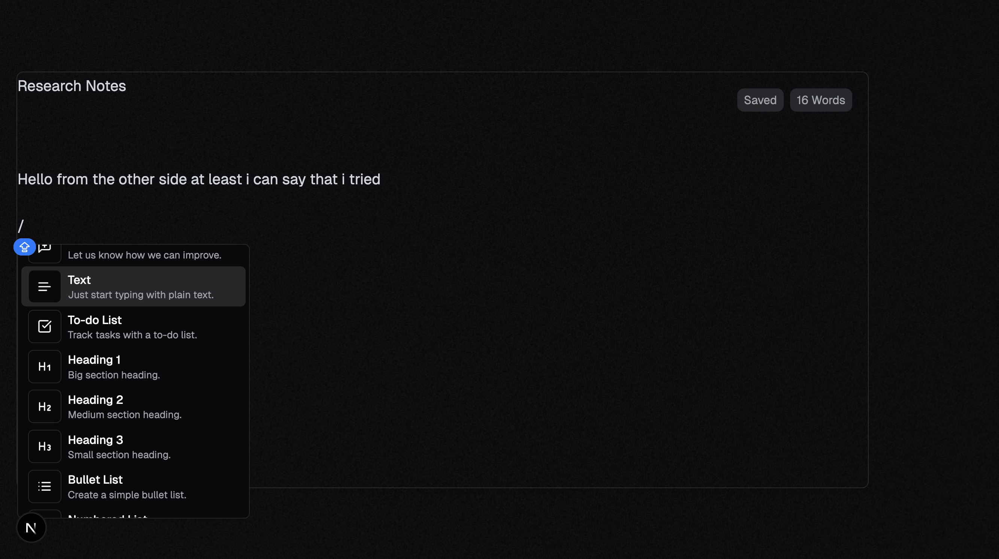

# Heyyo!

7 days ago we just had an idea, a lot of sketches and brainstorming for what technologies we should use and how the design/userflow should look like.
Now we have a working website maybe just on a local server but it's not just an idea anymore, it's not just sketches, it's actual software.

It has a face, so don't forget to waitlist: [waitlist](https://nuclearapp.ca/waitlist)

---

# The start

Thanks to all the previous long meetings, Ojas for all the pre-planning, Sathya for the assignment of tasks, Avan for the design direction we had our work set out for all of us.

{Future Karman: And, Karman for the cute devLog :))}

However,

---

## The problem

Apparently, there was a big problem with front-end implementation for the text-editor with React-Quill. In summary, it fucked us, the documentation was not documented properly.
However, Sahtya (yes Sahtya, because I like it more) saved us by suggesting Novel.
Sahtya and Ojas saved the initial implementation by putting in countless hours in just one week to fix it all up and make the code bullet-proof (maybe not 100% but definitely on its way)

---

## Summary

This week made me realize how making software is in reality, before this it was mostly just cute little projects or comp 250 assignments. However, making software is more about just making a function in the least possible complexity, but it is actually the relationship between the developers, its the github commit comments and the whole bunch of mess that comes before a neat little file of code that does what you want it to. 

          —---x—----------x—--------End: May 19 2025- Karman —-------x—----------x—--

