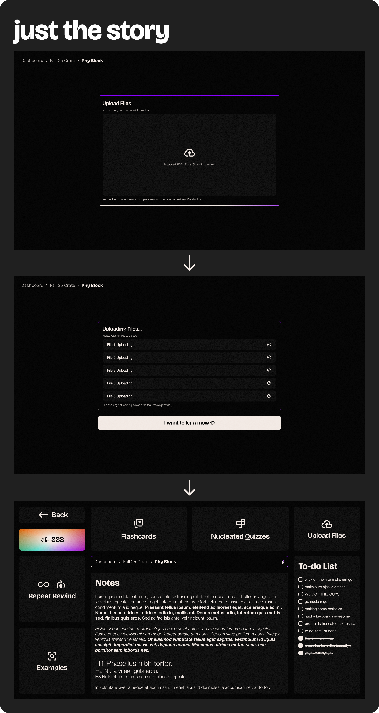
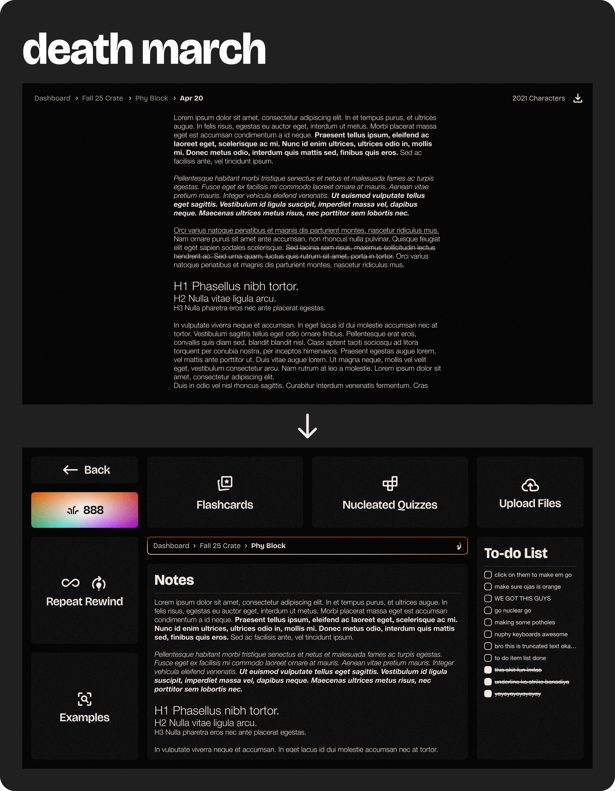

# bienvenue people

this week we had some basic working pages for the website but obviously a LOT more things to get done. **last week** we had a **working login sign up pages, onboarding flows,** and we **ditched react quill** and **adopted novel**! _(it worked out wonderfully for us, we love novel, man, it's so nice)_

# NEW STUFFFF HELL YEAH

i finished up **really cool designs for the block view**, so basically people will have crates 📦 📦 📦 and blocks 📜 📜 📜 , _where crates are like folders_ and _blocks are the individual pieces inside where the learning happens_.

we also have different flows and ui for different modes! in our first mode, **just the story**, users get to upload stuff and get the learning material striaght up, no fuss!

in our second mode, **story & sword**, users get to go through our learning process, before being able to access any of the learning resources we created. this is our preferred mode. we want students to use nuclear alongside their lectures, and not as a replacement. so we make sure to check if the student really does have a good amount of knowledge of the material and then we help them get better with our features ;) 

in our third mode, **death march**, users get to skip all these methods and go straight to notetaking. trust me, our notetaking is, BEAUTIFUL. the amount of notes i'd make in this is insane. this mode is intended for when students want to make notes during the class directly in nuclear! these notes then get processed and enhanced with our features!

users get to change modes on the dashboard and then based on which mode they are in, a new block will follow the above mentioned flows. **ofcourse, every other feature will be accessible once the flow is completed! :DDD**

> if any of you got the references :O just know that we love you

# the dev side of things

even the development side was **HUGE** for us this week _(i don't understand most stuff but yes on the up and up it seems cool)_

## **jonas** (ojas)

- worked on **transcription api's and prompt engineering**. he also made the potholes actually work, _it feels so cool seeing them work lmao._ 

- this dude has actual work 9 to 5 and also finds time to work on nuclear, insane man, i'm pretty sure he dreams about nuclear too, OH AND ALL THE EXTERNAL COMMS, he is literally stalking other projects 🤓, comparing us to others, talking to investors 🕴️, and so many people ohmy- crazy dude. 📈 📈 takes nice photos too. 📸

## **car man** (karman) 

- worked on the **backend for the notetaking, connecting the database with the potholes** and making that flow smooth, up and running. he's wrapping up the **input areas front end** integration right now which is _sweet._  

- carrr mannnn is cool 🚗, weirdly obsessed with userflows and user perspective 😔, but that's good too yk. this dude is on a research project 🥼, made a project of his own in the first week to wet his toes before dipping in completely into the world of code, and now working on nuclear. nice hair man has. 🪑

## **souhtya** (sathya)

- finished up the notetaking front end. he's wrapping up the **ocr api's** and integrating it into nuclear, and also on the **frontend** of the **story and sword** mode ;)

- this guy's the one that creates all the tickets for us and manages all our tasks, crazy work, looks dead af tho 💀

> _without these people, nuclear would be nothing istg, crazy people, even their uni life sounds so serious and complicated lmao. i just wanna take this space to appreciate them lmao, love these bunch of idiots. wish i could meet irl and do all this work irl but hey, some day, we will._ 😔 😔

# wrapping up

OH and yes we did our first post on linkedin, HEHEHE. it looks so COOL, make sure to go and like it: [linkedin post](https://www.linkedin.com/posts/nuclearapp_were-nuclear-an-ai-powered-note-taking-activity-7331393213133377537-xzmL)
| **that wasn't a request, go now, yes, now. :>>** |
|-----------------------|

that's all for week 3 honeys: _blocks, input pages, modes flows, linkedin post, potholessssss, all done._ check back in next week to see what we're up to ;)

adios muchachos / muchachas
